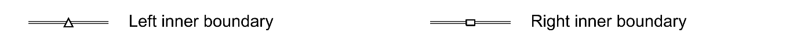
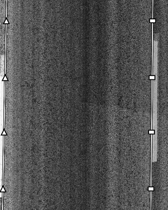
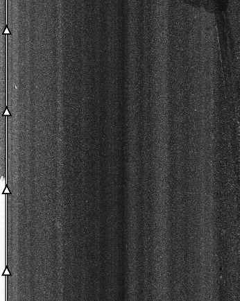
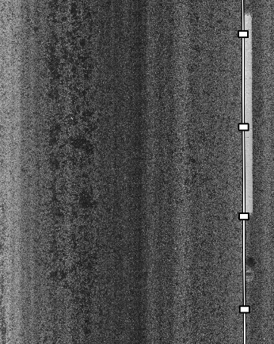
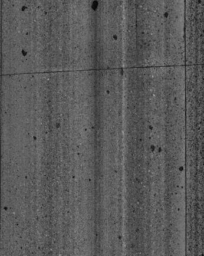

# OrthoLaneMark: Lane-Marking Detection Benchmark

Code and results for comparing lane-marking detection methods on orthographic pavement images. OrthoLaneMark evaluates whether left and right markings are present, how accurately their lane-facing inner boundaries are located, and how detection errors affect lane and wheelpath regions used in pavement distress measurement.

This repository accompanies the paper:

> **Presence-Aware Benchmarking of Lane-Marking Detection Methods for Pavement Distress Measurement**
>
> Haolin Wang, Shiwei Luo, Zhongyu Yang, and Yi-Chang J. Tsai
>
> Georgia Institute of Technology
>
> **Under review at the ASCE Journal of Computing in Civil Engineering (JCCE).**

<table>
  <tr>
    <td colspan="4" align="center"></td>
  </tr>
  <tr>
    <td align="center"></td>
    <td align="center"></td>
    <td align="center"></td>
    <td align="center"></td>
  </tr>
  <tr>
    <td align="center">Both present</td>
    <td align="center">Left only</td>
    <td align="center">Right only</td>
    <td align="center">Neither present</td>
  </tr>
</table>

**OrthoLaneMark annotation examples.** Present markings are annotated along their lane-facing inner edges; absent markings use the corresponding image edge for region evaluation. Symbols distinguish curves and do not represent annotation points.

## Benchmark overview

- **Nine methods:** Canny–Hough, LSD, Steger ridge, U-Net, SCNN, UFLDv2, PolyLaneNet, LaneATT, and CLRNet.
- **1,391 pavement images** from six surveyed road sections, with paired intensity and range images in PNG format.
- **Fixed spatial splits:** 835 training, 192 validation, and 294 test images; 70 images excluded as boundary buffers.
- **Evaluation:** marking presence, inner-boundary localization, gated region accuracy (GRA), and wheelpath disagreement.
- **Reproducible records:** selected configurations, per-image scores, saved predictions, and 18 selected checkpoints in a separate companion package.

The reported experiments use intensity images only. Splits are contiguous blocks within the same surveyed sections; they do not measure generalization to unseen routes. Each method is adapted to this task, with its own input resolution and output decoding. See the [benchmark protocol](docs/PROTOCOL.md) and [method adaptations](docs/METHOD_ADAPTATIONS.md).

## Results

Test-set GRA measures agreement of the derived lane region, gated by correct marking-presence decisions; higher is better. Learning-method values are the mean ± population standard deviation across seeds 0, 1, and 2.

| Method | Test GRA |
|---|---:|
| CLRNet | **0.9416 ± 0.0095** |
| PolyLaneNet | 0.9216 ± 0.0095 |
| SCNN | 0.9020 ± 0.0158 |
| LaneATT | 0.8214 ± 0.0521 |
| UFLDv2 | 0.7932 ± 0.0241 |
| LSD | 0.7810 |
| U-Net | 0.7671 ± 0.0147 |
| Canny–Hough | 0.7162 |
| Steger ridge | 0.5773 |

The quick-start command below reconstructs these summaries and the presence, localization, and wheelpath metrics from the saved results.

## Repository structure

```text
ortholanemark-benchmark/
├── README.md                    # Overview and quick start
├── LICENSE                      # MIT license for benchmark-authored code
├── LICENSE.md                   # License scope for code, results, and companions
├── CITATION.cff                 # Software citation metadata
├── lcms_lane_benchmark/         # Nine methods, data readers, and evaluators
├── configs/                    # Selected learning and traditional configurations
├── artifacts/                  # Saved predictions, scores, and selection records
├── tools/                      # Evaluation and verification commands
├── verification/               # Reference summaries and verification records
├── provenance/                 # Source, run, and file-hash manifests
├── LICENSES/                   # Retained third-party component licenses
└── docs/                       # Protocol, data, adaptations, and reproduction
```

## Installation and quick start

Run commands from the repository root. Python 3.12 is recommended, particularly for the pinned model dependencies. To reconstruct the reported tables, install the lightweight verification dependencies:

```sh
python -m pip install -r requirements-verification.txt
python tools/rebuild_tables.py --output work/reconstructed_tables.json
```

This writes JSON and CSV summaries under `work/` and verifies learning-method summaries against the retained results at an absolute tolerance of `1e-12`. It needs no dataset, GPU, or checkpoints.

Check file integrity, evaluated-source provenance, and evaluation geometry:

```sh
python tools/verify_integrity.py
python tools/verify_sources.py
python tools/run_synthetic_checks.py
python tools/check_edge_cases.py
```

For model interfaces, also install `requirements-models.txt`. Training environments and dependency limitations are documented in [ENVIRONMENTS.md](docs/ENVIRONMENTS.md); see [REPRODUCTION.md](docs/REPRODUCTION.md) for checkpoint loading and selected settings.

## Dataset and checkpoints

The dataset and checkpoint files are distributed as companion packages, separately from this GitHub repository:

| Package | Contents |
|---|---|
| **OrthoLaneMark: A Pavement Survey Dataset for Lane-Marking Detection** | 1,391 intensity/range PNG pairs, inner-boundary annotations, manifests, and fixed splits |
| **OrthoLaneMark Benchmark: Code, Results, and Checkpoints** | This repository and 18 selected checkpoints: six learning methods × three seeds |

For commands that use the companions, arrange the folders as follows. A GitHub clone can be renamed to `repository/` locally.

```text
OrthoLaneMark/
├── repository/
├── dataset/
└── checkpoints/
```

For example, evaluate saved CLRNet predictions against the dataset annotations:

```sh
python tools/evaluate_saved.py --dataset-root ../dataset --manifest ../dataset/manifests/manifest_paper.json --predictions artifacts/learning/clrnet_faithful_seed0/predictions_test.npz --output work/clrnet_seed0_metrics.json
```

This uses the saved predictions and original evaluator without loading a model. See [dataset and annotations](docs/DATASET_AND_ANNOTATIONS.md), [range-image details](docs/RANGE.md), and [checkpoint provenance](docs/CHECKPOINT_RIGHTS.md).

## Citation

Please cite this benchmark when using its code or results, and acknowledge the original methods described in [THIRD_PARTY_NOTICES.md](THIRD_PARTY_NOTICES.md). Machine-readable metadata is in [CITATION.cff](CITATION.cff).

```bibtex
@software{wang2026ortholanemark,
  author  = {Wang, Haolin and Luo, Shiwei and Yang, Zhongyu and Tsai, Yi-Chang J.},
  title   = {OrthoLaneMark Benchmark: Code, Results, and Checkpoints},
  year    = {2026},
  version = {1.0.0},
  url     = {https://github.com/THiNK327/ortholanemark-benchmark}
}
```

## License

- **Benchmark-authored code and documentation:** [MIT](LICENSE).
- **Saved scores and predictions:** [CC BY 4.0](https://creativecommons.org/licenses/by/4.0/).
- **Adapted third-party code:** original licenses and notices retained in [THIRD_PARTY_NOTICES.md](THIRD_PARTY_NOTICES.md).
- **Companion dataset and checkpoints:** see the [license overview](LICENSE.md), including the scope of checkpoint contributions and pretrained components.

## Contact

- Haolin Wang — [hlwang98@gatech.edu](mailto:hlwang98@gatech.edu)
- Zhongyu Yang (corresponding author) — [zyang398@gatech.edu](mailto:zyang398@gatech.edu)

The authors thank Raghu Veerareddy for assistance with data preparation. No funding was received for this study.
